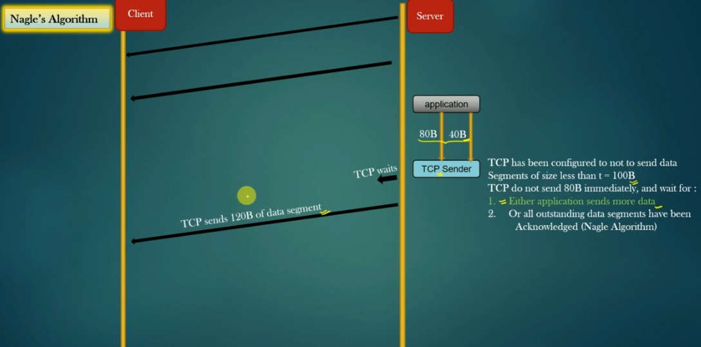

#### Related information:
[MTU vs MSS PMTUD](https://networkdirection.net/articles/network-theory/mtu-and-mss/)

#### TCP/IP Stack vs OSI Model -- Practical vs Reference
1. TCP is `Connection Oriented` which means it is announces the supported capabalities and capacity, estabilish session before exacnaging packets.
2. TCP is `Stateful` which means TCP keeps track of DATA sent and received using sequence numbers for both directions.
3. TCP is `Byte Oriented` which means TCP ensures every byte of data is delivered successfully.
    - Oredered delivery -- if there are Out of Order packets that have occured, TCP can rectify the oreder of the received packets and transmit them to the upper layer. 
    - Reliable delivery -- TCP retransmits lost packets. TCP uses ARQ(`Automatic Repeat Request`) for data recovery. 
    - Flow Congestion control -- Timers and Algoritms, Karen's Alg. Sliding Windows, DupAck, SlAck 
    - Windowing Mechamism -- 
    - MSS Maximum Segment Size -- depends on IP MTU and is the size of TCP segment's payload `MSS = MTU - IP && TCP-Headers`.  

##### Advanced TCP features:
- SAck
- DupAck
- Fast Recovery
- Nagl Algorithm

#### TCP(20 Bytes header IP6) vs UDP(8 Bytes header IP17)


#### ARQ Challenges:


#### Why TCP is Byte||Stream Oriented?
- Keeps track of application data sent and received at the byte level.
    - Each byte of data is tracked by unique ID called `Sequnce Num.` at both ends of the flow.    
- Data Sending and Receiving speed might not be the same and TCP need to buffer that data packets.
    - TCP is duplex protocol and needs buffers at both ends of the stream. TCP buffers are implemeted as `Circular Queues`.


- Data is segmented by TCP in order to be delivered.
    - Segment's size is decided dinamically and keeps on changing depending on network or recepient state.
    - Segment size is choosen to avoid IP unnecessary fragmentation at IP layer.
    - Segments contain `N` Bytes of data, where N is segment size. 
    - TCP stamp every byte it's sending in segments with unique number called `Sequence Number`
    - The SEQ Numb. of first byte is also treated as Segment number.   
        - Example: SeqNum = Segment Number + N-Bytes to be delivered. `Segment number 500 + 100Bytes = SeqNum of 599`
#### TCP Header:
           

- Seq Num. filed is mandatory and is always present in a TCP segment regradless of the `Segment Type`.
- Acknowledgement Num. is valid only when ACK bit/flag is set. Ack. Numb. confimrs the received segment by requesting the next byte of the next segment. Ex: last received segment Seq. Num. is 1499 and the Ack would be 1500 which means next segment is expected 1500. 
- Segment Types:
    - Data Segment
    - Pure Ack Segment
    - Data + Ack Segment

    

#### TCP Flags:
| Flag    | Full Name                 | Bit Position (in order) | Purpose                                                                                                                                                 |
| ------- | ------------------------- | ----------------------- | ------------------------------------------------------------------------------------------------------------------------------------------------------- |
| **CWR** | Congestion Window Reduced | 8th bit (highest)       | Sent by the sender to indicate it received an **ECE** and has reduced its congestion window (used in Explicit Congestion Notification, ECN).            |
| **ECE** | ECN-Echo                  | 7th bit                 | Used in ECN to indicate **congestion experienced**. In SYN packets, it indicates ECN capability; later, it echoes congestion back to sender.            |
| **URG** | Urgent                    | 6th bit                 | Indicates that the **Urgent Pointer** field is valid — data marked as urgent should be prioritized. Rarely used today.                                  |
| **ACK** | Acknowledgment            | 5th bit                 | Indicates that the **Acknowledgment Number** field is valid — acknowledges received data. Present in almost all packets after connection establishment. |
| **PSH** | Push                      | 4th bit                 | Requests that the receiver **immediately push** the data to the application (don’t wait for buffer to fill). Used by interactive apps (e.g., Telnet).   |
| **RST** | Reset                     | 3rd bit                 | Abruptly **terminates** a connection due to an error or unexpected condition.                                                                           |
| **SYN** | Synchronize               | 2nd bit                 | Used to **initiate** a TCP connection and synchronize sequence numbers.                                                                                 |
| **FIN** | Finish                    | 1st bit (lowest)        | Used to **gracefully close** a TCP connection; indicates no more data to send.                                                                          |
----
#### Typical Flag Combinations
| Flags      | Meaning                            |
| ---------- | ---------------------------------- |
| `SYN`      | Connection start (first handshake) |
| `SYN, ACK` | Second handshake (response)        |
| `ACK`      | Normal acknowledgment              |
| `FIN, ACK` | Graceful connection termination    |
| `RST, ACK` | Connection reset                   |
| `PSH, ACK` | Data transfer with push            |
| `ECE, CWR` | ECN congestion signaling           |

----
## Reliable delivery:
- Feedback mechanism -- Receiver's responsability is to send feedbacks messages to the sender == ACK messages.
- Retransmition Timer-- `RTO - by default Retransmit Timout 3sec but is adjusted based on SRTT` Sender starts a timer for each sent segment and if it's receiveng an ACK before it expiers then it's considered successfully delivered. Otherwise sender assumes data has been lost and it restransmits that segment and take actions to avoid congestion. By default a segment is retransmited 3 times and yeach time the RTO is doubled, EX: 1st time is 3 seconds, 2nd retry is 6 seconds and 3rd retry is 12 seconds.   

[Related info: TCP RTO and SRTT](https://www.catchpoint.com/blog/tcp-rtt)


## TCP Connection Management.

#### TCP uses 4 tuples to comunicate between end-to-end applications/processes:
The Source is seen as Active talker/Client that initiate the communication.
The Destination is seen as Passive talker/Server that is listening for incoming messages.

1. Source IP address.
2. Source L4-Port
3. Destination IP addr.
4. Destination L4-Port

#### 3Way Handshake 4Way closure:
- ISN - `Initial Sequence Number` is set individualy by both talkers(Client and Server). Each side must take it into account when it's ACKnowledging the received SYN message.
    - First two steps of handshake combined are called `Sequence Number Synchronization`.
- SYN Segments do not contain any application Data, yet they sonsume 1 sequence number because they need to be acknowledged. 
- FIN Segments may not contain any application data, yet they consume atleast 1 sequence number because they need to be acknowledged.   
- Pure ACK Segments do not contain any application data,they do not consume any (consecutive) sequence number either because ACKs are not acknowledged.
- DATA Segments consume sequence numbers.
    - NOTE: `Any segment that needs to be acknowledged consumes a sequence number.` 
- TCP States:                      
    - `CLIENT`................................................ `SERVER` LISTEN (Passive Open)
    1. (Active Open)SYN_SENT ----syn_J-->> SYN_RCVD 
    2. ESTABLISHED   <<--syn_K-ack_J+1----
    3.                --ack_K+1---------->> ESTABLISHED

    0. (Active Close)FIN_WAIT_1 --fin_M-->> CLOSE_WAIT(Passive Close)
    1. FIN_WAIT_2             <<--ack_M+1-- 
    2. TIME_WAIT              <<--fin_N---- LAST_ACK
    3.                        --ack_N+1-->> CLOSED


[Good resouces of TCP 3Way and Close](https://wentzwu.com/2020/10/15/tcp-3-way-handshake-process/)


#### TCP Connection Timeout
- By default numbre of max retries is 5 and the back-off is exponential. 
- SYN timeout is ?

## TCP Retransmition Timeout (RTO)
- RTO it's not a fixed value, it's dynamic value because the network itself it's dynamic and it needs to be adjusted accordingly.
- Intermediate nodes creates variations in delay which also is affecting the RTO.
- Problems that could arise if RTO too long or RTO to short
    - Too Long  -- Under utilization of network resources, Application delay/slowness.
    - Too Short -- Unnecesary retransmition, network congestions.

#### TCP behavior when congestion has been detected.
- Retransmition Mechanism
1. Time Based Retransmition `Based on RTO and Karn's Algorithm. It's slower than Fast-Retransmition because it's based on timers and Sender has to sit on IDLE waiting till timers expire`.
    
- Retransmition Ambiguity Problem
    1. Ambiguity may arise when an ACK is delayed or lost somewhre in the nework and the sender retransmits the lastest segment 
    2. At some point Receiver succeeds to ACK but the Sender is can't be sure if that ACK is for previous segment or for the retransmited one.
    3. Sender can't make a correct decision on the RTO: RTT between 1st segment and last ACK or 2nd(Retransmited) segment and last ACK ? 
    4. Solution: `Karn's Algorithm`

    


- Karn's Algorithm says:
    1. Ignore measured RTT for the retransmited segments in RTO evaluation
        - This solves the problem of Retransmition Ambiguity.  
        - If not ignored this would skew the RTO incorectly.
        - This will prevent TCP to take corrective measures to segment losses and breack TCP Adaptive Transmision. 

    2. Use Back-off RTT for retransmitted segments and do not consider their mesured RTT values in RTO evaluation.
        - Subsequent retransmition timers are doubled 
        - The back-off is not reset till there is a successful data delivery which doen't requere a retransmition.

2. Fast Retransmition `TCP sender almost immediately detects segment loss and retransmits it instantly`
    - A tipical TCP implementation suports both methods(TBR and FR). 
    - This feature allows TCP Recevier accepts out-of-order segments and to notify the Sender about lost segment from multipe received segments by triggering 3 x DupACKs for the lost segment(This depends on the number of sent segments after lost segment). 
    - In return Sender retranmists only the lost segment(s).
    - Multimple Holes Repair uses the same DupAcks to notifiy packet loss. Example in 3rd image. This might not be eficient when to many holes in buffer||loses. Selective ACK comes to solve multiple losses in one shot. 
    - Disadvantages of DupAck: Sender retransmits lost segment also it retransmits already sent and unlost sengments that are after lost segment. SACk solves this issue.


### NOTE: Time-based Retransmission looks like an Implicit behavior, but Fast-Retransmission is more like an on-demand Retransmission (explicit request...). OR this can be seen as direct vs indirect packet loss. When indirect loss is detected, TCP relies on timers, when a direct loss is reported, then relies on DupAcks.


#### Fast Retransmission Features:
- Selective ACKs: -- Optional mechanism in TCP
    - SACK use options field of TCP header in order to request missing segments using one ACK only. Similar to DupACKs when the recovery of missing segmens is needed. 
    - SACKs makes sender to retransmit missing segments(to fill up holles in Receiver's TCP buffer), Sender will use Selective Retranssmition in order to accomplish this.
    - SACK bloks == a pair of 32bits integers representing a hole. A SACK can contain 3 or 4 SACK blocks. A none-SACK receiver can repair only one hole per RTT vs 3|4 on SACK enabled.

- Cumulative ACKs: -- default mechanism in TCP
    - Used to Ack-lge multiple segments in one ACk, also called Delayed ACK.
    - Based on Delayed ACK Timer, the receiver is ACK-ing at regular base regardles of asymetric ammount of received segments. 
    - Receiver will prefer to ACK data using implicit TCP segments rather then explicit ACK, it means it might send data to the sender and ACK prevoius segment(s).

----

## Data Flow Control and Window Management:

- Q:
    1. What should be the `Segment size`?
    2. How many Segments a TCP sender is allowed to send to a Receiver in one SRTT?
    3. How many segments can a Receiver to store in its receiving buffer?
    4. How TCP sender knows the capacity of TCP Receiver to receive and process segments?

- Sliding Window Mechanism used to achive:
    - Reliable Data delivery
    - Congestion and Flow Control -- Managing the rate at which data is sent in order to not overload the receiving node or network.
    - Sender has a circular buffer called `Send Window` and receiver has a circular buffer called `Recv Window`.
    - Since TCP session is a full duplex comunication, each tallker has both, one send and receive buffer for every flow.
    - The size of Send Window always should be the same size as Recv Window so the receiving node could accommodate all data.


- Flow Control
    1. TCP receiver advertises the size of its recv window in every ACK that is sent to the TCP sender.
    2. TCP Sender sets the size of its `Send Window` to the value received from Rceiver in ACKs.
    3. By Definition, Send Window determines the number of bytes the TCP sender can send in one go.
    4. TCP Receiver controls the size of TCP Sender's Send Window, this controls the rate at which the TCP Sender can send data to the Receiver -- this is called `Window Based Flow Control`
    5. Congested TCP Receiver tends to reduce its recv window size and advertises reduced size of its recv window in own ACKs to the TCP Sender, in this way it's mitigating the congetion/losses.
    6. Both peers advertise the size of their respective `Recv Window` to the other during TCP connection establishment phase -- called `Three Way Handshake`        
    7. After session has been established, TCP keeps advertise WS in all TCP segments as a mechanism of control which can be used to reduce or increaze the WS.
    8. WS can be asymetric in a full duplex comunication, shouldn't be symetric.

#### Examples: initialy WS is advertised to the MAX value that peer supports because peers do not know if the network has any issue, assuming network is stable.


- Sliding Window Rules:
    1. Whenever the `pure ACK is received`, Send Window of recipient of ACK slides. 

    

    2. Whenever the `Data Segment is received`, recv Window of recipient of data segent slides. 

    

    3. Whenever the `Data Segment is received` combined with `ACK is received`, recv window and send window of recipients slide.

Note: Needs to be distinguished `Client SW && RW` vs `Server SW && RW`. Since TCP communication si full duplex, SW && RW of client and Server do not match. `Server SW == Client RW and  Client SW == Server RW`, Cross connection.

- UWS -- Usable windows Size 
- Pointers: 
    - UNA -- Points to the byte that was Sent but not yet acknoledged.
    - NXT -- Points to the byte next to be sent, in other words the byte that is not sent but the receiver is ready to receive it.


EXAMPLE:


#### TCP Tinygrams

- `TCP Tinygrams` - are TCP data segments carying application payloads of considerable small size as compared to the TCP Overhead/headers.
- If TCP payload is mere 2-5 Bytes being carried by TCP segments, then such segments are terms as TCP Tinygrams.


#### Nagle Algorithm
```
TCP has a configured of minimum payload, and is configured to do not send data segments of size less than that minimum treshold. 

Lets say 100 Bytes.
If an amount of 80 Bytes is sent to TCP from aplication layer then it won't be sent imediately into netowrk and: 
```
- TCP wait for:
    1. Either Application sends more data in order to push a bigger segment into network(`Might be slower or not than Nagle enabled?`).
    - `OR`
    2. All outstanding data segments have been acknowledged(`When Nagle Algorithm enabled`).

 


#### Benefits of Nagle Alg.:
1. Avoid of injecting too many Tinygrams segments into network in order to improve the efficiency.
2. Tinygrams are sent only when all outstanding segments have been removed from network ensuring tinygrams to do not contribute to `Network Congestions/Under-Utilization`
3. `Self-Clocking`: The sooner Ack comes back, the sooner data segment(tinygrams) is sent. 
4. `Trade-Off`: This increases the delay, fewer and larger segments are used but delay is higher.
5. When Nagle Alg. enabled then less amount of TCP data and ACK segments are sent into netowrk, less overhead.
   #### Note: Nagle Alg. was designed to improve the efficient utilization of the network when BW and Speed were expensive, but in today's modern network(low latency, transactional and time sensitive) it doesn't bring much benefits. Some applications disable it by default.  


#### TCP Window Resizing:

- TCP is `adaptive protocol` and it responds to network or recepient's state dinamically.
    - TCP peers slow down the rate of data exchange if network is congested or peers are slow consumers. 
    - TCP controls the rate of data exchange by resizing the send and recv windows.
    - Etities that influence the rate of comunication are:
        1. Recipient Capablility 
            - WS might shrink to 0 bytes this means sender has reduced its Send Window to zero and Sender can't send data anymore. `Q: for how long?` This sittuation can continue till receiving proccess has had removed P(pending) bytes to free buffer memory.
            - `A: Window Opening ACK Segment` is used to resume the data flow. Receiver will send and Opening ACK with WS size greater than 0(Zero).
            - Window Opening ACK is pure ACK message that inform the new WS and it might Ack the same segment received last time.
            - WOACKS is a pure ACK and it's no acknowleged and this is prone to situation when WOACKS are lost in network. Solution: `TCP probe segments` and RTO by Sender.
            - Probe Segments -- Once Send Window == 0 sender starts to send Probe segments periodically to the receiver. TPC probe segments also are called `TcpZeroWindowProbe Segments`
            - The timer to send probes is called `Persistent Timer` and == 1xRTO. Subsequent probes are sent as per exponential back-off mechanism.TCP never stops to send probes.
            - The purpose of the probes is to track the receiving window from TCP receiver.
            - Probe Segments are containing 1 Byte of APP data which makes them indistinguishable from regular data segments. 
            - TCP receiver responds to TcpZeroWindowProbe with pure ACKs called `TCPZeroWindowProbeAKC` including current WS. 
            - At the point when receiver ACKs with a WS greater than zero, subsequent ACKs are WOACKS nor Probes/ProbesACKs.
            - But at this step it's early to consider problem solved because recv's WS might not reach the desired size and variate betwen few Bytes that would lead to Small/Tynigram segments. This problem is called `Silly Window Syndrome`   
            - `Nagle Algh.` solve this problem on the Sender side and `SWS Avoidance rules` solve this problem on Recvr side.
            
                
        
        2. Network Capacity [TCP Clamping and TCP blackhole avoidance](https://blog.ipspace.net/2013/01/tcp-mss-clamping-what-is-it-and-why-do.html)

#### TCP Congestion Control Procedures
- Flow control deals with Slow Receivers and is driven by TCP Receivers (Using signaling Mechanism) 
- Congestion Control deals with Slow Network and is driven by TCP Sender (Using Congestion Control Procedures)
- Two Algorithms are used by CCP.
    1. Slow Start
    2. Congestion Avoidance 

#### Congestion Control Procedures enabels TCP sender to adopt itself to ever changing dynamic network. 
1. TCP sender somehow detect that the congestion is about to happen.
2. TCP sender slow down the rate of sending segments and determine how slow.
3. TCP sender somehow should be able to detect that the netowrk congestion state has improved and it can increase the rate of sending data and also determine how fast.

- `Congestion Window` -- is the mechanism that allows TCP Sender control the rate of transmition at the level of network capabilities.
    
    `W = min (cwnd, awnd)`
    - W = Send Window of Sender
    - awnd = advertised window of Receiver 
    - cwnd = congestion window of Sender 
    - cwnd is the measurement of Network Capacity 

- Congestion Control Algorithms
    1. Slow Start - Purpose of Slow Start Alg. is to determine the maximum rate at which TCP Sender can inject Segments into network without experiencing packet loss.
        - Slow Start is triggered by the folowing 3 conditions: 
            1. Executed when TCP is establishing a new connection, after 3WAY handshake. 
            2. Slow Start might be treggered when RTO/packet loss is detected by Sender.
            3. Sender doesn't send any data and is in IDLE for a certain amount of time.  
        - Initial cwnd is set to 1xMSS for all 3 above cases.
        - For the new connections TCP sender doesn't know the appropriate value of `cwnd`, therefore `cwnd == 1MSS and first segment size is = W where = min (cwnd1, awnd)`
        - TCP starts injecting packets into network at the lower rate an increase the rate exponentially until a certain condition `C` is met, conditions like congetion or TCP limit is reached.
        Example:
        - Initial cwnd = 1 MSS
        - MSS = 1460Bytes
        - awnd = 10 MSSes
        - According to the image, TCP will increase exponentially till it reaches or exceeds the limit of receiving window of the receiver which is 10 x MSSes while Sending window of the sender reached 16 x MSSes, Sender won't exceed 10xMSS.
        
        

    2. Congestion Avoidance
        - Executed imediately after slow start has finished
        - By this time appropiate cwnd has been determined.
        - TCP continue to inject more packets increasing the rate linearly until packet loss is detected.
        - SST - Slow Start Treshold is the variable that TCP Sender maintain and represents the `las best estimate of network capacity` when segment loss occurs.
        - SST and AWND are equal at fisrt initiation since it's related to AWND advertised by Receiver during 3WAY HS. When a loss is detected during slow start CWND is reset to 1 and SST is reduced in half. Then SlowStart's CWND gets equal to the SST TCP starts the Congestion Avoidance Mechanism which grows th bit rate linearly. This continue till CWND is >= to the Initial AWDN which is 200
        - Triggers CA: `cwnd >= SST`
        -

        
        


