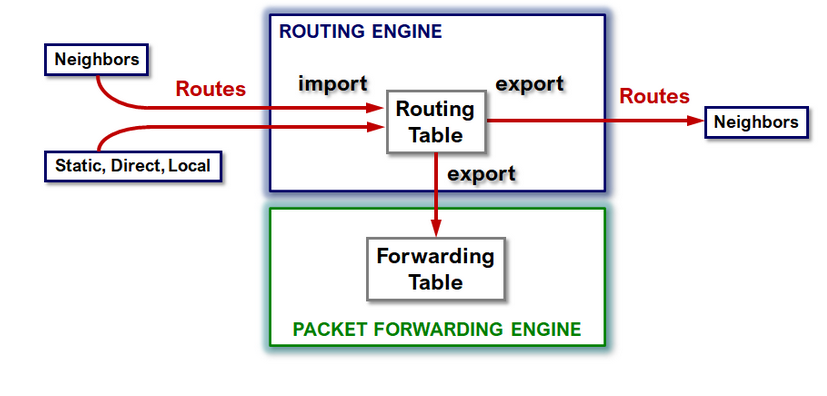
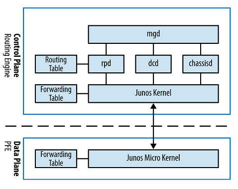
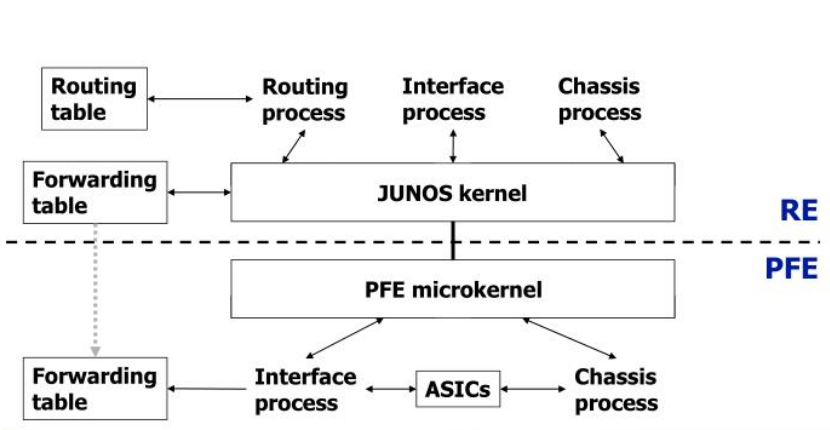
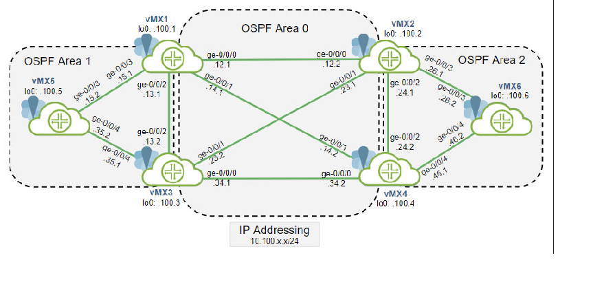
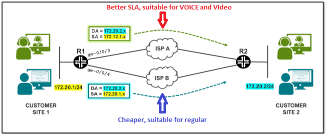

#vLab SSH passwd: jcluster/Juniper!1

- Module 01: Protocol Independent Routing Concepts
- Module 02: Protocol Independent Routing Configuring and Monitoring
----
## Protocol Independent Routing:
## Martian Addresses 
- Routers ingnore updated that anounce martian Addresses by defaul, except default route which is allowed 
- In order to change default behavoir we need to overide the default rules.
- >IPv4:   
    - allowed - 0.0.0.0/0          Exact
      - x - 0.0.0.0/8          Or-Longer    
      - x - 127.0.0.0/8        Or-Longer 
      - x - 192.0.0.0/24       Or-Longer
      - x - 240.0.0.0/4        Or-Longer
      - x - 224.0.0.0/4 & /24  Exact
- >IPv6:
    - allowed
      - x - ::/128             Exact
      - x - FF00::/8           Exact
      - x - FF02::/8           Exact  
```
show route martian [table inet.0]
inet.0:
             0.0.0.0/0 exact -- allowed
             0.0.0.0/8 orlonger -- disallowed
             127.0.0.0/8 orlonger -- disallowed
             192.0.0.0/24 orlonger -- disallowed
             240.0.0.0/4 orlonger -- disallowed
             224.0.0.0/4 exact -- disallowed
             224.0.0.0/24 exact -- disallowed

set routing-options martians 192.0.2.0/24 orlonger
set routing-options martians 240/4 orlonger allow       *//to permit for a default entery

martians {
    128.0.0.0/16 orlonger allow;
    191.255.0.0/16 orlonger allow;
    223.255.255.0/24 exact allow;
    240.0.0.0/4 orlonger allow;
    192.0.0.7/32 exact allow;
    192.0.0.8/32 exact allow;
}
```

# Static routes and floating routes:
 - Default AD/Preference 5
 - A summary/aggregated static route Will stay in RT even no contributing route is present in RT, A route like this doesn't have a next-hop but discard keyword.

```
set routing-options static route 192.168.1.0/24 discard
set routing-options static route 192.168.1.0/24 next-hop 10.1.1.1
set routing-options static route 192.168.1.0/24 qualified-next-hop 10.1.2.1 preference 6

static {
    route 0.0.0.0/0 {
        next-hop 10.1.1.18;
        no-readvertise;
        resolve;
        tag 666;
        preference 240;
    }
}
```

# To read: [Very Good reference](https://momcanfixanything.com/aggregate-generated-additional-notes/)
## Aggregated Route`(Summary/Discard route)` https://www.juniper.net/documentation/en_US/junos/topics/concept/policy-aggregate-routes.html
  - Default AD/Preference 130
  - Discard routes -- by default next-hop is "Reject" if its not specified, available options are discard & reject
  - An aggregate route becomes active when it has one or more contributing routes(CISCo: subsequent)
  - Oposit to genereated routes it includes direct connected routes as contributing route.
  - Aggregate routes are esential to BGP since those preservs BGP rooting information like AS-SET && others. Static/Generated won't assuming using discard for all. 

  NOTE: The summary route’s next-hop is taken from the “primary” contributing route’s next-hop. Which route is chosen as the primary, you ask? Here’s the process:
- Choose the route with the lowest route preference (aka administrative distance)
- If there’s more than one route with the same preference, use the lowest IP address number as a tie breaker

```
  set routing-options aggregate route 172.20.0.0/22 [discard|reject]
  
  aggregate {
    route 10.0.0.0/22 [discard|reject]; 
    }
```
## Generated Route`(default route/last resort route)` - is a type of aggregated route. [A good reference](https://www.networkfuntimes.com/junos-aggregate-routes-vs-generate-routes-how-to-summarise-on-juniper-routers/)
  - Default AD/Preference 130
  - Usually used for last resort route or default route
  - The summary route’s next-hop is taken from the “primary” contributing route’s next-hop by citeria:"
    - Choose the route with the lowest route preference (aka administrative distance)
    - If there’s more than one route with the same preference, use the lowest IP address number as a tie breaker"

##   NOTE: Only routes that have a working, valid next-hop can contribute to a generate route. 
##         That’s important to remember. It means that the presence of a directly-attached LAN will NOT contribute to a 
##         generated route, because there’s no clear next-hop.
```	
	generate {
    route 0.0.0.0/0 policy FILTER_POLICY; 				*//contributing routes can be filtered in order to influence 
    }
	
 set routing-options generate route 192.168.0.0/21     *//nexh hop is not necesary because it is boarowed from primay contributing route

 show route protocol aggregate detail     *//shows both types Aggregated and Generated(last one has next hop ip)
 show route prefix/legh exact detail 
```

## Routing Instances: - is a logical segmentation of a router.
### Master Routing Instance[RI]: default RI in JunOS
#### Most important RIBs: [Link to Mom's blog inet.2](https://momcanfixanything.com/junos-routing-tables-part-1/)
    - unicast:    inet.0 = IPv4, inet6.0 = IPv6  
    - multicast:  inet.1 = IPv4 - multicast forwarding cache
                  inet.2 = Used by MP-BGP for Unicast routes used for multicast RPF lookup.(Stores IPv4 Unicast Routes used for Multicast(Ex: PIM) Reverse-path-forwarding) 
                           `inet.2 is a UNICAST routing table; used for multicast traffic RPF checks, but still a unicast routing table.` 
				  inet.4 = Used for Multicast Source Discovery Protocol(MSDP) route entires.
    - MPLS:       inet.3 = MPLS for path information, underlayed network between PE and P routers.
                            Populated by an IGP {ISIS, OSPF, RIPv2}
                  mpls.0 = Label Switch Path information next-hops

    - iso.0     -- ISIS NETs
    - inet.0	-- IPv4 unicast
    - inet.2	-- RPF checks for multicast traffic or/and MPLS LSP. Unpopulated by default. Needs to import interfaces and roouting tables into rib-groups. https://community.juniper.net/communities/community-home/digestviewer/viewthread?MID=63648
    - inet.3	-- (BGP Next-Hop Resolution)MPLS egress point for LSP<<-{LDP|RSVP}. Using IGP/LDP to install inter-AS links into inet.3 to resolve the unchanged BGP next-hop using an LSPs.    
    - inet6.0   -- IPv6 unicast 

# RIB Groups: [To Read 1](https://momcanfixanything.com/junos-rib-groups-1-2/) &&  [To Read 2](https://momcanfixanything.com/junos-rib-groups-2-2/)
### Route Leaking: Difference between `RIB-GROUPS` and instance-import: [To Read 3](http://matt.dinham.net/route-leaking-with-junos/) 
### Route Leaking Methods:
 1. A physical loop using an interface connection from a RI to another interface from the other RI.
 2. Logical Tunnels same concept as 1. but using virtual interfaces.(Licence and platform limitations). To share routes between RIs a routing protocol is needed or static routes. 
```	
[edit chassis fpc 0 pic 0]
+     tunnel-services;
[edit interfaces]
+   lt-0/0/0 {
+       unit 0 {
+           encapsulation ethernet;
+           peer-unit 1;
+           family inet {
+               address 172.16.1.1/30;
+           }
+       }
+       unit 1 {
+           encapsulation ethernet;
+           peer-unit 0;
+           family inet {
+               address 172.16.1.2/30;
+           }
+       }
+   }
```	
 3. Instance Import/Export: RI-A to RI-B 
```
[edit]
+  policy-options {
+      policy-statement FROM_GLOBAL {
+          term 1 {
+              from instance master;
+              then accept;
+          }
+          term 2 {
+              then reject;
+          }
+      }
+  }
[edit routing-instances BACKBONE]
+    routing-options {
+        instance-import FROM_GLOBAL;
+    }
```
### NOTE: 
#### However, it’s important to document the fundamental difference between the two. In essence, instance-import works on FIB routes and rib-groups work on RIB routes.
#### That is to say that instance-import will only export the currently active route(s) from the source VRF whereas rib-groups will export all routes from the target VRF.
#### `Below see import/export RIB-GROUPS:`
#### You need to make sure you configure the routing table the routes would go to by default first. Else you might get an error message when trying to commit. 

 4. rib-groups import and apply to [ interfaces-routes | Static routes | Dynamic routes ]

```	
routing-options {
	rib-groups {
		rg-copy-routes {
		  import-rib [ RI-A.inet.0 RI-B.inet0 ]   *// this statment means RI-A is imported to RI-B EX: [wehre.routes.are.placed_by_default.inet.0 wehre.to.copy.those.routes.inet.0 ]
 		  }
	}
}
```
---------
### From Master.inet.0 to Custom.inet.0 
```
jcluser@vMX1# show | compare 
[edit routing-options]
+   interface-routes {
+       rib-group inet MGMT2BACKBONE;				*//apply MGMT2BACKBONE RIB-GROUP to interface-routes(I can uderstand this is applied to the direct/local routes only)
+   }
+   rib-groups {
+       MGMT2BACKBONE {
+           import-rib [ inet.0 BACKBONE.inet.0 ];  *//This config is simply stating any routes that would normally be placed in inet.0 should also be placed in BACKBONE.inet.0.
+       }
+   }
```
### From Custom.inet.0 to Master.inet.0
```
[edit routing-options]
+  rib-groups {
+      AREA2toMGMT {
+          import-rib [ AREA-2.inet.0 inet.0 ];
+      }
+  }

[edit routing-instances AREA-2]
+    routing-options {
+        interface-routes {
+            rib-group inet AREA2toMGMT;
+        }
+    }
```
---------
## Import Policy Example
```
policy-options {
    policy-statement DEFAULT {
        term t1 {
            from {
                route-filter 0.0.0.0/0 exact;
            }
            then accept;
        }
        term t2 {
            then reject;
        }
    }
}
rib-groups {
    MGMT2BACKBONE {
        import-rib [ inet.0 BACKBONE.inet.0 ];
        import-policy DEFAULT;
    }
}
```
---------
## NOTE: However, creating the rib-group alone will not achieve anything – the rib-group must be applied elsewhere in the configuration. 
##	     `The rib-group should be applied on RI from where routes are imported.` 
##       You have several options depending on what you want to do:

  - Interface routes – set routing-options interface-routes rib-group <name>
  - Static routes – set routing-options rib-group <name>
  - Dynamic routes, these are applied per protocol, e.g. set protocols ospf rib-group <name>
    - `set protocols ospf rib-group inet MGMT2BACKBONE`

# Routing Instance types: 
### Routing Instance is a logical segmentation of a physical router. This applies on RIB and FIB only. Logical systems is another feature that allows to virtualise the entire system including users and protocols.
	+1. Forwarding—Use this routing instance type for filter-based forwarding applications(PBR). For this instance type, there is no one-to-one mapping between an interface and a routing instance. All interfaces belong to the default instance inet.0.
	
	+2. Nonforwarding—Use this routing instance type when a separation of routing table information is required. There is no corresponding forwarding table. All routes are installed into the default forwarding table. IS-IS instances are strictly nonforwarding instance types.
	
	+3. Virtual router—Similar to a VPN routing and forwarding instance type, but used for non-VPN-related applications. There are no virtual routing and forwarding (VRF) import, VRF export, VRF target, or route distinguisher requirements for this instance type. 
	
	+4. VRF—Use the VPN routing and forwarding routing (VRF) instance type for Layer 3 VPN implementations. This routing instance type has a VPN routing table as well as a corresponding VPN forwarding table. For this instance type, 
		there is a one-to-one mapping between an interface and a routing instance. Each VRF instance corresponds with a forwarding table. Routes on an interface go into the corresponding forwarding table. 
	
	5. VPLS—Use the virtual private local-area network service (VPLS) routing instance type for point-to-multipoint LAN implementations between a set of sites in a VPN. 
	
	6. MPLS forwarding—Use this routing instance type to provide support for protection against label spoofing or errant label injection across autonomous system border routers (ASBRs).
	
	7. Layer 2 VPN—Use this routing instance type for Layer 2 virtual private network (VPN) implementations.
	
	8. Ethernet VPN (EVPN) (MX Series routers only)—Use this routing instance type to connect a group of dispersed customer sites using a Layer 2 virtual bridge.
	
	9. Internet Multicast over MPLS—Use this routing instance type to provide support for ingress replication provider tunnels to carry IP multicast data between routers through an MPLS cloud, using MBGP or next-generation MVPN.
	
	10. Virtual switch—(MX Series routers only) Use the virtual switch instance type to isolate a LAN segment with its Spanning Tree Protocol (STP) instance and separates its VLAN identifier space. 
		For more detail information about configuring a virtual switch, see the Junos OS Layer 2 Switching and Bridging Library for Routing Devices.
	
	11. MAC-VRF—(MX Series and vMX routers; QFX5100, QFX10002-60C, QFX5110, QFX5120, QFX5200, QFX10002, QFX10008, and QFX10016 switches; EX9200 Series switches only) 
		Use this routing instance type to configure multiple customer-specific EVPN instances (EVIs) of type mac-vrf, each of which can support a different EVPN service type. 
		This configuration results in customer-specific virtual routing and forwarding (VRF) tables with MAC addresses on each Juniper Networks device that serves as a virtual tunnel endpoint (VTEP) in the EVPN-VXLAN network. 
		This type of routing instance is for EVPN unicast routes only.
	12. Layer2-control—(MX Series routers only) Use this routing instance type for RSTP or MSTP in customer edge interfaces of a VPLS routing instance. 
		This instance type cannot be used if the customer edge interface is multihomed to two provider edge interfaces. If the customer edge interface is multihomed to two provider edge interfaces, use the default BPDU tunneling.
	13. Layer 2 Backhaul VPN—(MX Series routers only) Use this routing instance type to provide support for Layer 2 wholesale VLAN packets with no existing corresponding logical interface. 
		When using this instance, the router learns both the outer tag and inner tag of the incoming packets, when the instance-role statement is defined as access, or the outer VLAN tag only, when the instance-role statement is defined as nni.
 
>### Troubleshoting commands
```
    show route all
    show route hidden
    show route table BACKBONE.inet.0 hidden 10.100.100.0/28 extensive
	show route instance summary
    show route instance CORPORATE summary  
    show route instance CORPORATE detail    *//Shows the interfaces that are tied to the CORPORATE Routing Instance
	show route summary
	show route table BACKBONE
	show route table BACKBONE.inet.0 
	show route instance BACKBONE
	ping 10.100.100.2 routing-instance BACKBONE
    

    show route resolution                       *//shows indirect next-hop resolution aka static route with resolve keyword? 
    show route prefix/pref_leght
    show route forwarding-table destination prefix/pref_leght
    show route 192.168.1.0/25 extensive | match reason
                Inactive reason: Not Best in its group - Router ID
                Inactive reason: Not Best in its group - Router ID
                Inactive reason: Not Best in its group - Router ID

```
>>### Logical-System commnads:	 https://momcanfixanything.com/logical-systems-and-virtual-routers/
```
set cli logical-system NAME 
clear cli logical-system 
set logical-system NAME [routing-options | interface | etc.]
show route 0.0.0.0 logical-system NAME
show route logical-system NAME
```
===============================================================================================================================
### ECMP -- Load-Balancing: By default no load-balancing on juniper devices.  
#### Below Diagrams are supposed to help in understanding the Policy's import/export boundaries in Juniper OS
   

```
set policy-options policy-statment LoadBalancing then load-balance per-packet	*//even though it’s per-packet the load-balancing is performed per flow.
set routing-options forwarding-table export LoadBalancing

dotel@vMX5# show | compare
[edit]
+  policy-options {
+      policy-statement ECMP {
+          then {
+              load-balance per-packet;
+          }
+      }
+  }
[edit routing-options]
+   forwarding-table {
+       export ECMP;
+   }

[edit]
dotel@vMX5#

set policy-options policy-statement ECMP then load-balance per-packet
set routing-options forwarding-table export ECMP
```
---- 
# vLabs RI -- Paste in Browser CTRL+ALT+SHIFT && RIGHT CLICK
## RI Virtual-Router:
### R1 
```
delete protocol ospf

set routing-instances BACKBONE routing-options aggregate route 10.100.12.0/22
set routing-instances BACKBONE protocols ospf area 0.0.0.0 interface ge-0/0/0.0 interface-type p2p
set routing-instances BACKBONE protocols ospf area 0.0.0.0 interface ge-0/0/1.0 interface-type p2p
set routing-instances BACKBONE protocols ospf area 0.0.0.0 interface ge-0/0/2.0 interface-type p2p
set routing-instances BACKBONE protocols ospf area 0.0.0.0 interface lo0.0
set routing-instances BACKBONE instance-type virtual-router
set routing-instances BACKBONE interface ge-0/0/0.0
set routing-instances BACKBONE interface ge-0/0/1.0
set routing-instances BACKBONE interface ge-0/0/2.0
set routing-instances BACKBONE interface lo0.0
```
### R2 VS routing-instances BACKBONE routing-options static route 10.100.12.0/22 discard
```
delete protocol ospf

set routing-instances BACKBONE routing-options aggregate route 10.100.16.0/20 discard
set routing-instances BACKBONE protocols ospf area 0.0.0.0 interface ge-0/0/0.0 interface-type p2p
set routing-instances BACKBONE protocols ospf area 0.0.0.0 interface ge-0/0/1.0 interface-type p2p
set routing-instances BACKBONE protocols ospf area 0.0.0.0 interface ge-0/0/2.0 interface-type p2p
set routing-instances BACKBONE protocols ospf area 0.0.0.0 interface lo0.0
set routing-instances BACKBONE instance-type virtual-router
set routing-instances BACKBONE interface ge-0/0/0.0
set routing-instances BACKBONE interface ge-0/0/1.0
set routing-instances BACKBONE interface ge-0/0/2.0
set routing-instances BACKBONE interface lo0.0
```
## OSPF Multi-Areas vLAB and Route leaking between RIB-GROUPS:


### R1
```
delete protocols ospf

set routing-instances CORPORATE routing-options router-id 1.1.1.1
set routing-instances CORPORATE instance-type virtual-router
set routing-instances CORPORATE protocols ospf area 0.0.0.0 interface ge-0/0/0.0 interface-type p2p
set routing-instances CORPORATE protocols ospf area 0.0.0.0 interface ge-0/0/1.0 interface-type p2p
set routing-instances CORPORATE protocols ospf area 0.0.0.1 interface ge-0/0/2.0 interface-type p2p
set routing-instances CORPORATE protocols ospf area 0.0.0.1 interface ge-0/0/3.0 interface-type p2p
set routing-instances CORPORATE protocols ospf area 0.0.0.0 interface lo0.0 passive 
set routing-instances CORPORATE interface ge-0/0/0.0
set routing-instances CORPORATE interface ge-0/0/1.0
set routing-instances CORPORATE interface lo0.0
set routing-instances CORPORATE interface ge-0/0/2.0
set routing-instances CORPORATE interface ge-0/0/3.0

set policy-options policy-statement ECMP then load-balance per-packet
set routing-options forwarding-table export ECMP

show | compare | no-more

commit and-quit

#Route leaking config-----------------------------------------------------------------------------
set routing-options rib-groups CORP2MASTER import-rib CORPORATE.inet.0
set routing-options rib-groups CORP2MASTER import-rib inet.0

set routing-instances CORPORATE protocols ospf rib-groups inet CORP2MASTER
set routing-instances CORPORATE routing-options interface-routes rib-group inet CORP2MASTER
#-------------------------------------------------------------------------------------------------
set interfaces lo0 unit 1 family inet address 192.168.10.1/24

set routing-options interface-routes rib-group inet MASTER2CORP

set routing-options rib-groups MASTER2CORP import-rib inet.0
set routing-options rib-groups MASTER2CORP import-rib CORPORATE.inet.0
set routing-options rib-groups MASTER2CORP import-policy Loopback_only

set policy-options policy-statement Loopback_only term 1 from protocol direct
set policy-options policy-statement Loopback_only term 1 from route-filter 192.168.10.0/24 exact
set policy-options policy-statement Loopback_only term 1 then accept
set policy-options policy-statement Loopback_only term 2 then reject

jcluser@vMX1> ping 10.100.100.1 source 192.168.10.1 rapid count 3 
PING 10.100.100.1 (10.100.100.1): 56 data bytes
!!!
--- 10.100.100.1 ping statistics ---
3 packets transmitted, 3 packets received, 0% packet loss
round-trip min/avg/max/stddev = 0.015/0.026/0.048/0.016 ms
```
## RI Frowarding: Filter Based Forwarding – FBF

#### The instance-type is `forwarding`. It is NOT a virtual-router!!
#### This type of routing-instance is much simpler. It does not require, or even accept configuring interfaces or routing-protocols, and only allows the configuration of static routes.
#### Their purpose in life: to create a separate forwarding table that you can use to forward traffic a certain way. 
### Use case: Filter Base Forwarding!
### CASE 1 - Network consists of two sites connected through two different ISPs, as shown in the picture. 
### [ -->> REFERENCE LINK](https://momcanfixanything.com/junos-rib-groups-2-2/)

### NOTE: for the scenarion depicted in the above diagram requires that PBR/FBF is applied on R1 and R2 for the reverse traffic.
#### In order to apply this scenario OSPF multi-area vLAB woudld used by creating RIA and RIB on R5 and R6.
[Diagram OSPF Muti-Area](./vLABmultiAreaOSPF.png)
### R5
``` 
ATNT: don’t forget to add the instance-type.
The default routing-instance type is no-forwarding!!!!! 
This type of routing instance allows configuring interfaces (except for lo0), 
and protocols with some restrictions, but it has no corresponding forwarding table. Not very helpful for our use case!
``` 
```
jcluser@vMX5# show routing-instances | display set 
set routing-instances RI-A routing-options static route 10.100.100.6/32 next-hop 10.100.15.1
set routing-instances RI-A instance-type forwarding
set routing-instances RI-B routing-options static route 10.100.100.6/32 next-hop 10.100.35.1
set routing-instances RI-B instance-type forwarding

[edit]
jcluser@vMX5# show firewall | display set 
set firewall family inet filter FBF-CCTV term 1 from destination-address 10.100.100.6/32
set firewall family inet filter FBF-CCTV term 1 from protocol udp
set firewall family inet filter FBF-CCTV term 1 from protocol tcp
set firewall family inet filter FBF-CCTV term 1 from destination-port 16376-32767
set firewall family inet filter FBF-CCTV term 1 from destination-port 1720
set firewall family inet filter FBF-CCTV term 1 then routing-instance RI-A
set firewall family inet filter FBF-CCTV term 2 from destination-address 10.100.100.6/32
set firewall family inet filter FBF-CCTV term 2 then routing-instance RI-B
set firewall family inet filter FBF-CCTV term 3 then accept

[edit]
jcluser@vMX5# set interfaces ge-0/0/7.0 family inet filter input FBF-CCTV 

[edit]
jcluser@vMX5# show interfaces ge-0/0/7.0 | display set 
set interfaces ge-0/0/7 unit 0 family inet filter input FBF-CCTV
set interfaces ge-0/0/7 unit 0 family inet address 192.168.100.1/24

show | compare | no-more

commit and-quit
```
#### Verification:
```
jcluser@vMX5# run show route table RI-A                            

RI-A.inet6.0: 1 destinations, 1 routes (1 active, 0 holddown, 0 hidden)
+ = Active Route, - = Last Active, * = Both

ff02::2/128        *[INET6/0] 00:44:29
                       MultiRecv

[edit]
jcluser@vMX5# run show route table RI-B    

RI-B.inet6.0: 1 destinations, 1 routes (1 active, 0 holddown, 0 hidden)
+ = Active Route, - = Last Active, * = Both

ff02::2/128        *[INET6/0] 00:44:34
                       MultiRecv

jcluser@vMX5# run show route forwarding-table table RI-A    
Routing table: RI-A.inet
Internet:
Destination        Type RtRef Next hop           Type Index    NhRef Netif
default            perm     0                    rjct      595     1
0.0.0.0/32         perm     0                    dscd      593     1
224.0.0.0/4        perm     0                    mdsc      594     1
224.0.0.1/32       perm     0 224.0.0.1          mcst      597     1
255.255.255.255/32 perm     0                    bcst      598     1

jcluser@vMX5# run show route forwarding-table table RI-B    
Routing table: RI-B.inet
Internet:
Destination        Type RtRef Next hop           Type Index    NhRef Netif
default            perm     0                    rjct      604     1
0.0.0.0/32         perm     0                    dscd      602     1
224.0.0.0/4        perm     0                    mdsc      603     1
224.0.0.1/32       perm     0 224.0.0.1          mcst      606     1
255.255.255.255/32 perm     0                    bcst      607     1
```
#### At this point no routes in RI-A and RI-B because ge-0/0/3 and ge-0/0/4 are not part of those Routing Instances.
#### In orders to solve this issue a rib-group needs to be configured to copy DIRECT routes from inet0 to RI A and B.
```
jcluser@vMX5# show policy-options | display set                   
set policy-options policy-statement ONLY_DIRECT term 1 from protocol direct
set policy-options policy-statement ONLY_DIRECT term 1 from interface ge-0/0/3.0
set policy-options policy-statement ONLY_DIRECT term 1 to rib RI-A.inet.0
set policy-options policy-statement ONLY_DIRECT term 1 then accept
set policy-options policy-statement ONLY_DIRECT term 2 to rib RI-A.inet.0
set policy-options policy-statement ONLY_DIRECT term 2 then reject
set policy-options policy-statement ONLY_DIRECT term 3 from protocol direct
set policy-options policy-statement ONLY_DIRECT term 3 from interface ge-0/0/4.0
set policy-options policy-statement ONLY_DIRECT term 3 to rib RI-B.inet.0
set policy-options policy-statement ONLY_DIRECT term 3 then accept
set policy-options policy-statement ONLY_DIRECT term 4 to rib RI-B.inet.0
set policy-options policy-statement ONLY_DIRECT term 4 then reject
set policy-options policy-statement ONLY_DIRECT term 5 then accept

jcluser@vMX5# show routing-options | display set
set routing-options interface-routes rib-group inet inet0_to_RI-AB
set routing-options rib-groups inet0_to_RI-AB import-rib inet.0
set routing-options rib-groups inet0_to_RI-AB import-rib RI-A.inet.0
set routing-options rib-groups inet0_to_RI-AB import-rib RI-B.inet.0
set routing-options rib-groups inet0_to_RI-AB import-policy ONLY_DIRECT
```
#### Verification:
```
jcluser@vMX5# run show route table RI-A 

RI-A.inet.0: 2 destinations, 2 routes (2 active, 0 holddown, 0 hidden)
+ = Active Route, - = Last Active, * = Both

10.100.15.0/24     *[Direct/0] 00:03:00
                    >  via ge-0/0/3.0
10.100.100.6/32    *[Static/5] 00:03:00
                    >  to 10.100.15.1 via ge-0/0/3.0

RI-A.inet6.0: 1 destinations, 1 routes (1 active, 0 holddown, 0 hidden)
+ = Active Route, - = Last Active, * = Both

ff02::2/128        *[INET6/0] 00:38:07
                       MultiRecv

[edit]
jcluser@vMX5# run show route table RI-B    

RI-B.inet.0: 2 destinations, 2 routes (2 active, 0 holddown, 0 hidden)
+ = Active Route, - = Last Active, * = Both

10.100.35.0/24     *[Direct/0] 00:03:05
                    >  via ge-0/0/4.0
10.100.100.6/32    *[Static/5] 00:03:05
                    >  to 10.100.35.1 via ge-0/0/4.0

RI-B.inet6.0: 1 destinations, 1 routes (1 active, 0 holddown, 0 hidden)
+ = Active Route, - = Last Active, * = Both

ff02::2/128        *[INET6/0] 00:38:12
                       MultiRecv

jcluser@vMX5# run show route forwarding-table table RI-A         
Routing table: RI-A.inet
Internet:
Destination        Type RtRef Next hop           Type Index    NhRef Netif
default            perm     0                    rjct      595     1
0.0.0.0/32         perm     0                    dscd      593     1
10.100.15.0/24     user     0                    rtbl        1     4
10.100.100.6/32    user     0 10.100.15.1        ucst      587    10 ge-0/0/3.0
224.0.0.0/4        perm     0                    mdsc      594     1
224.0.0.1/32       perm     0 224.0.0.1          mcst      597     1
255.255.255.255/32 perm     0                    bcst      598     1

jcluser@vMX5# run show route forwarding-table table RI-B    
Routing table: RI-B.inet
Internet:
Destination        Type RtRef Next hop           Type Index    NhRef Netif
default            perm     0                    rjct      604     1
0.0.0.0/32         perm     0                    dscd      602     1
10.100.35.0/24     user     0                    rtbl        1     4
10.100.100.6/32    user     0 10.100.35.1        ucst      588     9 ge-0/0/4.0
224.0.0.0/4        perm     0                    mdsc      603     1
224.0.0.1/32       perm     0 224.0.0.1          mcst      606     1
255.255.255.255/32 perm     0                    bcst      607     1
```