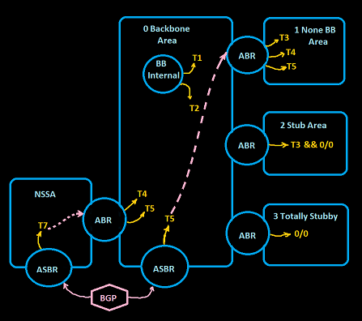
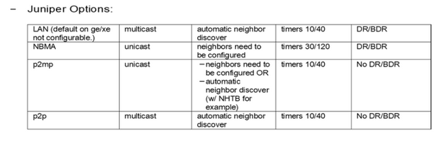
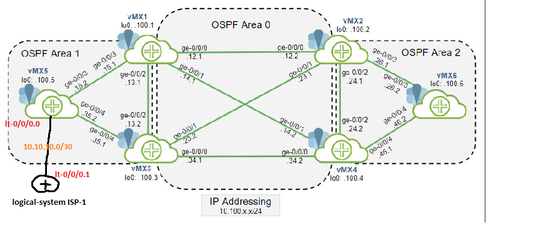

#vLab SSH passwd: jcluster/Juniper!1

- Module 03: OSPF Overview
- Module 04: OSPF Configuring and Monitoring
- [Very Good Reference:](https://momcanfixanything.com/ospf-summary/)

----
# OSPF:
## Termninology Recap:
- IP protocol `89`
- SPF `- Djikstra Algh.`
- MCAST `All SPF Routers - 224.0.0.5`
	    `DR router/pseudo node - 224.0.0.6`
- Timers: `Hello(10)` & `Dead-timer(40)` || `NBMA(30/120)`; `LSA-MaxAge(60mins||3600sec); LAS-Refresh `. 
- AD/Preference: `10/100`
- External routes: `E1/E2 Routers that are imported into OPSF process from other sourcs like: static, direct, routing-protocols ` 
- DR/BDR - (Backup) Designated Router`Priority(0-255; 128=default) or Loopback IP or Physical interface IP`
- ABR - Area Border Router
- ASBR - Autonomus Sysytem Border Router
- Backbone Router - An OSFP router that has at least one interface in AREA 0
- LSDB - a distributed DB and gets populated by LSAs
- LSA seq number: -- is the same on all OSPF routers unless a change occured. Originating router incremet the seq num and re-flood the LSA. 
- LSA age time:   -- if no LSA change in each 30 mins LSA-Refresh timer`(defaults: Cisco == 30mins||1800sec; Juniper == 50mins||3000sec)`, then the age timer is set to 0 and LSA Seq Num incremented and the originating router re-floods the LSA. Also. when an originationg router needs to flush the LSA for the area, it sets the LSA age timer to `C&J: MaxAge==3600sec` and re-floods the LSA making other OSPF routers to remove that LSA from its LSDB.


 

> #### LSAs - Link State Advertisments: 
>> - Type 1 -- Router ID -- Same Area on a particular link/subnet
>> - Type 2 -- Network -- DR/BDR ID
>> - Type 3 -- NetSummary route -- Between Areas `Type 3 LSAs do not triger recalculation of SPF algorithm, because the T3 LSAs do not actually describe the topology. Even T3 cost change or falp it is flooded but the SPF recomputation doesn't occur`
>> - Type 4 -- ASBR 
>> - Type 5 -- External		-- E1/E2 [default is E2,`E1 routes are preferred over E2 routes for the same destination. Both Type 1 and Type 2 external metrics can be present in the AS at the same time.  In that event, Type 1 external metrics always take precedence.`]
>> - Type 6 -- MOSPF(Not supported by CISCO & Juniper) 
>> - Type 7 -- NSSA External
>> - Type 8-11 -- (on Cisco) IPv6 related. 
>> - Type 9: used for graceful restart capability
>> - Type 10: used for MPLS traffic engineering
							
### Packet Types:
 - Hello [Packet Format and Info](./OSPFHelloPacket.png)
 - DBD          -- not only used when nighborship is forming, also used when a router learns new LSAs and needs to inform those to other neighbors that have to know about new LSAs. As response other neighbors send LSRs and recive LSUs after.
 - LSA-Reqest
 - LSA-Update
 - LSAck


#### FSM Neighbor States:
- Down
- *Attempt -- `A static neighbor is defined and a hello packet is sent but no hello recived back.`
- INIT
- 2-Way
- ExStart
- ExChange
- Loading
- Full
- *Waiting -- `This is the state on a OSPF enabled (non p2p) interface where none neighbors are attached`

#### Network Types and Timers:
- p2p
- p2mp
- p2m-nonbroadcast `Not an option in Juniper's implementation`
- broadcast
- NBMA -- PS: `Cisco timers: 30/120 sec. only if BW is less than 1500kbps`




#### Path-type Preference for OSPF Routes - There are four possible types of paths used to route traffic to the destination listed here in decreasing order of preference:
- 1. intra-area -- Intra-area paths indicate destinations belonging to one of the router’s attached areas.
- 2. inter-area -- Inter-area paths are paths to destinations in other OSPF areas. These are discovered through the examination of received summary-LSAs T3.
- 3. type 1 external -- AS external paths are paths to destinations external to the AS. These are detected through the examination of received AS-external-LSAs T5/T7.
- 4. type 2 external -- E1 routes always are preferred over E2 routes for the same destination. When all paths are Type 2 external paths, the paths with the smallest advertised Type 2 metric are always preferred. 

#### Loop avoiding mechanisms when more the one ABRs connected to the same two areas:
- 1. The ABR - When choosing the best route, an intra-area route is always better than competing inter-area route, regardless of metric.
- 2. If an ABR learns a Type 3 LSA inside a None-Backbone Area, the ABR ingnores that LSA when calculating its own routes.
- 3. Route filtering may occur only on ABRs/ASBRs and on the the routing table in/out but LSDB side, it must be the same on all routers that belongs to the same area. 

----
# vLabs OSPF -- Paste in Browser CTRL+ALT+SHIFT && RIGHT CLICK

## OSPF Single-Areas
### R1 
```
delete protocol ospf

set routing-instances BACKBONE routing-options aggregate route 10.100.12.0/22
set routing-instances BACKBONE protocols ospf area 0.0.0.0 interface ge-0/0/0.0 interface-type p2p
set routing-instances BACKBONE protocols ospf area 0.0.0.0 interface ge-0/0/1.0 interface-type p2p
set routing-instances BACKBONE protocols ospf area 0.0.0.0 interface ge-0/0/2.0 interface-type p2p
set routing-instances BACKBONE protocols ospf area 0.0.0.0 interface lo0.0
set routing-instances BACKBONE instance-type virtual-router
set routing-instances BACKBONE interface ge-0/0/0.0
set routing-instances BACKBONE interface ge-0/0/1.0
set routing-instances BACKBONE interface ge-0/0/2.0
set routing-instances BACKBONE interface lo0.0

show | compare | no-more

commit
```

### R2 VS routing-instances BACKBONE routing-options static route 10.100.12.0/22 discard
```
delete protocol ospf

set routing-instances BACKBONE routing-options aggregate route 10.100.16.0/20 discard
set routing-instances BACKBONE protocols ospf area 0.0.0.0 interface ge-0/0/0.0 interface-type p2p
set routing-instances BACKBONE protocols ospf area 0.0.0.0 interface ge-0/0/1.0 interface-type p2p
set routing-instances BACKBONE protocols ospf area 0.0.0.0 interface ge-0/0/2.0 interface-type p2p
set routing-instances BACKBONE protocols ospf area 0.0.0.0 interface lo0.0
set routing-instances BACKBONE instance-type virtual-router
set routing-instances BACKBONE interface ge-0/0/0.0
set routing-instances BACKBONE interface ge-0/0/1.0
set routing-instances BACKBONE interface ge-0/0/2.0
set routing-instances BACKBONE interface lo0.0

show | compare | no-more

commit
```

## OSPF Multi-Areas vLAB:


### R1
```
delete protocols ospf

set routing-instances CORPORATE routing-options router-id 1.1.1.1
set routing-instances CORPORATE instance-type virtual-router
set routing-instances CORPORATE protocols ospf area 0.0.0.0 interface ge-0/0/0.0 interface-type p2p
set routing-instances CORPORATE protocols ospf area 0.0.0.0 interface ge-0/0/1.0 interface-type p2p
set routing-instances CORPORATE protocols ospf area 0.0.0.1 interface ge-0/0/2.0 interface-type p2p
set routing-instances CORPORATE protocols ospf area 0.0.0.1 interface ge-0/0/3.0 interface-type p2p
set routing-instances CORPORATE protocols ospf area 0.0.0.0 interface lo0.0 passive 
set routing-instances CORPORATE interface ge-0/0/0.0
set routing-instances CORPORATE interface ge-0/0/1.0
set routing-instances CORPORATE interface lo0.0
set routing-instances CORPORATE interface ge-0/0/2.0
set routing-instances CORPORATE interface ge-0/0/3.0

set policy-options policy-statement ECMP then load-balance per-packet
set routing-options forwarding-table export ECMP

show | compare | no-more

commit and-quit

#Route leaking config-----------------------------------------------------------------------------
set routing-options rib-groups CORP2MASTER import-rib CORPORATE.inet.0
set routing-options rib-groups CORP2MASTER import-rib inet.0

set routing-instances CORPORATE protocols ospf rib-groups inet CORP2MASTER
set routing-instances CORPORATE routing-options interface-routes rib-group inet CORP2MASTER
#-------------------------------------------------------------------------------------------------
set interfaces lo0 unit 1 family inet address 192.168.10.1/24

set routing-options interface-routes rib-group inet MASTER2CORP

set routing-options rib-groups MASTER2CORP import-rib inet.0
set routing-options rib-groups MASTER2CORP import-rib CORPORATE.inet.0
set routing-options rib-groups MASTER2CORP import-policy Loopback_only

set policy-options policy-statement Loopback_only term 1 from protocol direct
set policy-options policy-statement Loopback_only term 1 from route-filter 192.168.10.0/24 exact
set policy-options policy-statement Loopback_only term 1 then accept
set policy-options policy-statement Loopback_only term 2 then reject

jcluser@vMX1> ping 10.100.100.1 source 192.168.10.1 rapid count 3 
PING 10.100.100.1 (10.100.100.1): 56 data bytes
!!!
--- 10.100.100.1 ping statistics ---
3 packets transmitted, 3 packets received, 0% packet loss
round-trip min/avg/max/stddev = 0.015/0.026/0.048/0.016 ms
```

### R2
```
delete protocols ospf

set routing-instances CORPORATE routing-options router-id 2.2.2.2
set routing-instances CORPORATE instance-type virtual-router
set routing-instances CORPORATE protocols ospf area 0.0.0.0 interface ge-0/0/0.0 interface-type p2p
set routing-instances CORPORATE protocols ospf area 0.0.0.0 interface ge-0/0/1.0 interface-type p2p
set routing-instances CORPORATE protocols ospf area 0.0.0.2 interface ge-0/0/2.0 interface-type p2p
set routing-instances CORPORATE protocols ospf area 0.0.0.2 interface ge-0/0/3.0 interface-type p2p
set routing-instances CORPORATE protocols ospf area 0.0.0.0 interface lo0.0 passive 
set routing-instances CORPORATE interface ge-0/0/0.0
set routing-instances CORPORATE interface ge-0/0/1.0
set routing-instances CORPORATE interface lo0.0
set routing-instances CORPORATE interface ge-0/0/2.0
set routing-instances CORPORATE interface ge-0/0/3.0

set policy-options policy-statement ECMP then load-balance per-packet
set routing-options forwarding-table export ECMP

show | compare | no-more

commit and-quit
```

### R3
```
delete protocols ospf

set routing-instances CORPORATE routing-options router-id 3.3.3.3
set routing-instances CORPORATE instance-type virtual-router
set routing-instances CORPORATE protocols ospf area 0.0.0.0 interface ge-0/0/0.0 interface-type p2p
set routing-instances CORPORATE protocols ospf area 0.0.0.0 interface ge-0/0/1.0 interface-type p2p
set routing-instances CORPORATE protocols ospf area 0.0.0.1 interface ge-0/0/2.0 interface-type p2p
set routing-instances CORPORATE protocols ospf area 0.0.0.1 interface ge-0/0/4.0 interface-type p2p
set routing-instances CORPORATE protocols ospf area 0.0.0.0 interface lo0.0 passive 
set routing-instances CORPORATE interface ge-0/0/0.0
set routing-instances CORPORATE interface ge-0/0/1.0
set routing-instances CORPORATE interface lo0.0
set routing-instances CORPORATE interface ge-0/0/2.0
set routing-instances CORPORATE interface ge-0/0/4.0

set policy-options policy-statement ECMP then load-balance per-packet
set routing-options forwarding-table export ECMP

show | compare | no-more

commit and-quit
```

### R4
```
delete protocols ospf

set routing-instances CORPORATE routing-options router-id 4.4.4.4
set routing-instances CORPORATE instance-type virtual-router
set routing-instances CORPORATE protocols ospf area 0.0.0.0 interface ge-0/0/0.0 interface-type p2p
set routing-instances CORPORATE protocols ospf area 0.0.0.0 interface ge-0/0/1.0 interface-type p2p
set routing-instances CORPORATE protocols ospf area 0.0.0.2 interface ge-0/0/2.0 interface-type p2p
set routing-instances CORPORATE protocols ospf area 0.0.0.2 interface ge-0/0/4.0 interface-type p2p
set routing-instances CORPORATE protocols ospf area 0.0.0.0 interface lo0.0 passive 
set routing-instances CORPORATE interface ge-0/0/0.0
set routing-instances CORPORATE interface ge-0/0/1.0
set routing-instances CORPORATE interface lo0.0
set routing-instances CORPORATE interface ge-0/0/2.0
set routing-instances CORPORATE interface ge-0/0/4.0

set policy-options policy-statement ECMP then load-balance per-packet
set routing-options forwarding-table export ECMP

show | compare | no-more

commit and-quit
```

### R5
```
delete protocols ospf

set routing-instances CORPORATE routing-options router-id 5.5.5.5
set routing-instances CORPORATE instance-type virtual-router
set routing-instances CORPORATE protocols ospf area 0.0.0.1 interface ge-0/0/3.0 interface-type p2p
set routing-instances CORPORATE protocols ospf area 0.0.0.1 interface ge-0/0/4.0 interface-type p2p
set routing-instances CORPORATE protocols ospf area 0.0.0.1 interface lo0.0 passive
set routing-instances CORPORATE interface ge-0/0/3.0
set routing-instances CORPORATE interface ge-0/0/4.0
set routing-instances CORPORATE interface lo0.0 

set policy-options policy-statement ECMP then load-balance per-packet
set routing-options forwarding-table export ECMP

show | compare | no-more

commit and-quit
```					  
### R6 
```
delete protocols ospf

set routing-instances CORPORATE routing-options router-id 6.6.6.6       
set routing-instances CORPORATE instance-type virtual-router
set routing-instances CORPORATE protocols ospf area 0.0.0.2 interface ge-0/0/3.0 interface-type p2p
set routing-instances CORPORATE protocols ospf area 0.0.0.2 interface ge-0/0/4.0 interface-type p2p
set routing-instances CORPORATE protocols ospf area 0.0.0.2 interface lo0.0 passive
set routing-instances CORPORATE interface ge-0/0/3.0
set routing-instances CORPORATE interface ge-0/0/4.0
set routing-instances CORPORATE interface lo0.0 

set policy-options policy-statement ECMP then load-balance per-packet
set routing-options forwarding-table export ECMP

show | compare | no-more

commit and-quit
```
### OSPF Thoot Commands:
```
show ospf intercae [instance CORPORATE]
show ospf neighbor [instance CORPORATE]
show ospf route [instance CORPORATE]
show ospf database [extensive | instance CORPORATE]
show ospf log [instance CORPORATE]
show ospf route [instance CORPORATE]
show ospf route intra [instance CORPORATE]
show ospf route inter [instance CORPORATE]
show route protocol ospf <destination/len> [table CORPORATE.inet.0 | ]
```
### OSPF monitoring and logs files:
```
monitor traffic interface <faceing ospf neghbor.0> matching "ip src neighbor_ip"
set protocols ospf traceoptions file ospf.log size 10M
set protocols ospf traceoptions flag error
set protocols ospf traceoptions flag event

```
----
```
--------------------------------------------------------------------------------
jcluser@vMX1> show ospf route 10.100.100.5 instance CORPORATE 
Topology default Route Table:

Prefix             Path  Route      NH       Metric NextHop       Nexthop      
                   Type  Type       Type            Interface     Address/LSP
10.100.100.5/32    Intra Network    IP            1 ge-0/0/3.0    10.100.15.2
--------------------------------------------------------------------------------
jcluser@vMX1> show ospf route 10.100.100.5 instance CORPORATE detail 
Topology default Route Table:

Prefix             Path  Route      NH       Metric NextHop       Nexthop      
                   Type  Type       Type            Interface     Address/LSP
10.100.100.5/32    Intra Network    IP            1 ge-0/0/3.0    10.100.15.2
  area 0.0.0.1, origin 5.5.5.5, priority medium
--------------------------------------------------------------------------------
jcluser@vMX1> show ospf database [summary | area| netsummary| asbrsummary| router| brief| detail| extensive| lsa-id| advertising-router| nssa| ] [instance CORPORATE] {logical-system NAME]  

jcluser@vMX1> show ospf database summary
Area 0.0.0.0:
   4 Router LSAs
   16 Summary LSAs
Area 0.0.0.1:
   3 Router LSAs
   24 Summary LSAs
Externals:
Interface ge-0/0/0.0:
Area 0.0.0.0:
Interface ge-0/0/1.0:
Area 0.0.0.0:
Interface ge-0/0/2.0:
Area 0.0.0.1:
Interface ge-0/0/3.0:
Area 0.0.0.1:
Interface lo0.0:
Area 0.0.0.0:
--------------------------------------------------------------------------------
jcluser@vMX1> show route protocol ospf 10.100.100.5/32 exact    

CORPORATE.inet.0: 21 destinations, 21 routes (21 active, 0 holddown, 0 hidden)
+ = Active Route, - = Last Active, * = Both

10.100.100.5/32    *[OSPF/10] 02:44:16, metric 1
                    >  to 10.100.15.2 via ge-0/0/3.0
--------------------------------------------------------------------------------
jcluser@vMX1> show route protocol ospf 10.100.100.5/32 exact detail 

CORPORATE.inet.0: 21 destinations, 21 routes (21 active, 0 holddown, 0 hidden)
10.100.100.5/32 (1 entry, 1 announced)
        *OSPF   Preference: 10
                Next hop type: Router, Next hop index: 615
                Address: 0xc741d5c
                Next-hop reference count: 3
                Next hop: 10.100.15.2 via ge-0/0/3.0, selected
                Session Id: 0x146
                State: <Active Int>
                Age: 2:44:18 Metric: 1 
                Validation State: unverified 
                Area: 0.0.0.1
                Task: CORPORATE-OSPF
                Announcement bits (1): 2-KRT 
                AS path: I 
--------------------------------------------------------------------------------
```
### Adding an ASBR to the topology in order to Redistribute BGP to OSPF: 

### Logical-System and LT interface + OSPF to BGP and vice versa.  
#### R5
```
-------------------------#Logical System Config:
set logical-systems ISP-1 policy-options policy-statement DEFAULT-4-CUSTOMERS term 1 from protocol static
set logical-systems ISP-1 policy-options policy-statement DEFAULT-4-CUSTOMERS term 1 from route-filter 0.0.0.0/0 exact
set logical-systems ISP-1 policy-options policy-statement DEFAULT-4-CUSTOMERS term 1 then accept
set logical-systems ISP-1 policy-options policy-statement DEFAULT-4-CUSTOMERS term 2 then reject
set logical-systems ISP-1 policy-options policy-statement LOOPBACK_ONLY term 1 from protocol direct
set logical-systems ISP-1 policy-options policy-statement LOOPBACK_ONLY term 1 from route-filter 172.16.1.0/24 exact
set logical-systems ISP-1 policy-options policy-statement LOOPBACK_ONLY term 1 then accept
set logical-systems ISP-1 policy-options policy-statement LOOPBACK_ONLY term 2 then reject

set logical-systems ISP-1 policy-options policy-statement CORPORATE-X-OUT term DEFAULT-ONLY from protocol static
set logical-systems ISP-1 policy-options policy-statement CORPORATE-X-OUT term DEFAULT-ONLY from route-filter 0.0.0.0/0 exact
set logical-systems ISP-1 policy-options policy-statement CORPORATE-X-OUT term DEFAULT-ONLY then accept
set logical-systems ISP-1 policy-options policy-statement CORPORATE-X-OUT term LOOPBACK_ONLY from protocol direct
set logical-systems ISP-1 policy-options policy-statement CORPORATE-X-OUT term LOOPBACK_ONLY from route-filter 172.16.1.0/24 exact
set logical-systems ISP-1 policy-options policy-statement CORPORATE-X-OUT term LOOPBACK_ONLY then accept
set logical-systems ISP-1 policy-options policy-statement CORPORATE-X-OUT term DENY-ANY then reject

set logical-systems ISP-1 routing-options router-id 10.10.10.1
set logical-systems ISP-1 routing-options autonomous-system 11111
set logical-systems ISP-1 routing-options static route 0.0.0.0/0 discard

set logical-systems ISP-1 interfaces lo0 unit 1 family inet address 172.16.1.1/24
set logical-systems ISP-1 protocols bgp group CORPORATE-X type external
   (set|delete) logical-systems ISP-1 protocols bgp group CORPORATE-X export [DEFAULT-4-CUSTOMERS LOOPBACK_ONLY]  *//this didn't work well so I've moved all terms into one policy 
set logical-systems ISP-1 protocols bgp group CORPORATE-X export CORPORATE-X-OUT
set logical-systems ISP-1 protocols bgp group CORPORATE-X neighbor 10.10.10.2 peer-as 55555

-------------------------#Routing-Instance Config:
set policy-options policy-statement OSPF2BGP-ISP-1 term 1 from protocol aggregate
set policy-options policy-statement OSPF2BGP-ISP-1 term 1 from route-filter 10.100.100.0/24 exact
set policy-options policy-statement OSPF2BGP-ISP-1 term 1 then accept
set policy-options policy-statement OSPF2BGP-ISP-1 term 2 then reject

set policy-options policy-statement BGP2OSPF term DEFAULT-ROUTE from protocol bgp
set policy-options policy-statement BGP2OSPF term DEFAULT-ROUTE from route-filter 0.0.0.0/0 exact
set policy-options policy-statement BGP2OSPF term DEFAULT-ROUTE then accept
set policy-options policy-statement BGP2OSPF term ISP-1-LOOPBACK from protocol bgp
set policy-options policy-statement BGP2OSPF term ISP-1-LOOPBACK from route-filter 172.16.1.0/24 exact
set policy-options policy-statement BGP2OSPF term ISP-1-LOOPBACK then accept
set policy-options policy-statement BGP2OSPF term DENY_ANY then reject

set policy-options policy-statement ISP1-BGP-IN term DEFAULT_ONLY from protocol bgp
set policy-options policy-statement ISP1-BGP-IN term DEFAULT_ONLY from route-filter 0.0.0.0/0 exact
set policy-options policy-statement ISP1-BGP-IN term DEFAULT_ONLY then accept
set policy-options policy-statement ISP1-BGP-IN term DENY_ANY then reject

set routing-instances CORPORATE protocols ospf export BGP2OSPF 

set routing-instances CORPORATE routing-options router-id 5.5.5.5
set routing-instances CORPORATE routing-options autonomous-system 55555
set routing-instances CORPORATE routing-options aggregate route 10.100.100.0/24

set routing-instances CORPORATE protocols bgp group ISP-1 type external
set routing-instances CORPORATE protocols bgp group ISP-1 import ISP1-BGP-IN
set routing-instances CORPORATE protocols bgp group ISP-1 export OSPF2BGP-ISP-1
set routing-instances CORPORATE protocols bgp group ISP-1 neighbor 10.10.10.1 peer-as 11111

-------------------------#Logical-Tunnel Config:
set chassis fpc 0 pic 0 tunnel-services

set interfaces lt-0/0/0 unit 0 encapsulation ethernet
set interfaces lt-0/0/0 unit 0 peer-unit 1
set interfaces lt-0/0/0 unit 0 family inet address 10.10.10.2/30
set routing-instances CORPORATE interface lt-0/0/0.0

set logical-systems ISP-1 interfaces lt-0/0/0 unit 1 encapsulation ethernet
set logical-systems ISP-1 interfaces lt-0/0/0 unit 1 peer-unit 0
set logical-systems ISP-1 interfaces lt-0/0/0 unit 1 family inet address 10.10.10.1/30
```
### Verifications:
```
-------------------------#ISP-1 advertises both 0/0 and loopvack
jcluser@vMX5> show route logical-system ISP-1 advertising-protocol bgp 10.10.10.2 

inet.0: 6 destinations, 6 routes (6 active, 0 holddown, 0 hidden)
  Prefix  Nexthop       MED     Lclpref    AS path
* 0.0.0.0/0               Self                                    I
* 172.16.1.0/24           Self                                    I

jcluser@vMX5> show route logical-system ISP-1 receive-protocol bgp 10.10.10.2             

inet.0: 6 destinations, 6 routes (6 active, 0 holddown, 0 hidden)
  Prefix  Nexthop       MED     Lclpref    AS path
* 10.100.100.0/24         10.10.10.2                              55555 I

inet6.0: 1 destinations, 1 routes (1 active, 0 holddown, 0 hidden)

jcluser@vMX6> show route 172.16.1.0    

inet.0: 3 destinations, 3 routes (3 active, 0 holddown, 0 hidden)
+ = Active Route, - = Last Active, * = Both

0.0.0.0/0          *[Static/5] 03:28:26
                    >  to 100.123.0.1 via fxp0.0

CORPORATE.inet.0: 20 destinations, 20 routes (20 active, 0 holddown, 0 hidden)
+ = Active Route, - = Last Active, * = Both

0.0.0.0/0          *[OSPF/150] 00:29:19, metric 0, tag 0
                    >  to 10.100.26.1 via ge-0/0/3.0
                       to 10.100.46.1 via ge-0/0/4.0

-------------------------#vMX5 ASBR CORPORATE recevie only 0/0
jcluser@vMX5> show route advertising-protocol bgp 10.10.10.1 table CORPORATE        

CORPORATE.inet.0: 24 destinations, 24 routes (23 active, 0 holddown, 1 hidden)
  Prefix  Nexthop       MED     Lclpref    AS path
* 10.100.100.0/24         Self                                    I

jcluser@vMX5> show route receive-protocol bgp 10.10.10.1                        

inet.0: 3 destinations, 3 routes (3 active, 0 holddown, 0 hidden)

CORPORATE.inet.0: 24 destinations, 24 routes (23 active, 0 holddown, 1 hidden)
  Prefix  Nexthop       MED     Lclpref    AS path
* 0.0.0.0/0               10.10.10.1                              11111 I

-------------------------#vMX6 area 2 router reaches ISP-1 loopback address only via default route
jcluser@vMX6> ping 172.16.1.1 routing-instance CORPORATE source 10.100.100.6    
PING 172.16.1.1 (172.16.1.1): 56 data bytes
64 bytes from 172.16.1.1: icmp_seq=0 ttl=61 time=3.570 ms
64 bytes from 172.16.1.1: icmp_seq=1 ttl=61 time=3.281 ms
64 bytes from 172.16.1.1: icmp_seq=2 ttl=61 time=2.663 ms
64 bytes from 172.16.1.1: icmp_seq=3 ttl=61 time=3.157 ms
64 bytes from 172.16.1.1: icmp_seq=4 ttl=61 time=3.354 ms
64 bytes from 172.16.1.1: icmp_seq=5 ttl=61 time=2.925 ms
```

